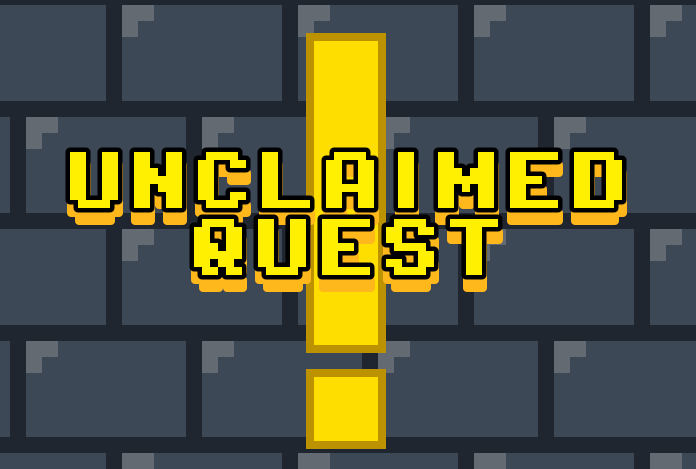

<html lang="en">
<head>
    <meta charset="UTF-8">
    <meta name="viewport" content="width=device-width, initial-scale=1.0">
    <title>Stephen Gantt</title>
    
</head>
<body>

<header>
    <h1>Stephen Gantt</h1>
    <nav>
        <a href="#about">About</a>
        <a href="#projects">Projects</a>
        <a href="#contact">Contact</a>
    </nav>
</header>

<section class="hero">
    
    <h2>Welcome to My Website</h2>
    
Game designer, software developer, artist.

</section>

<section id="about" class="section">
    <h2>About Me</h2>
    

        <strong>Stephen Gantt</strong> is an aspiring game designer with several years of
        programming experience and a strong background in game development through
        personal projects and game jam participation. He served as the primary
        developer for <em>Unclaimed Quest</em> in the 2025 Inbound Shovel Game Jam.
    

    

        Beyond programming and game engines, Stephen has experience with 3D
        modeling and texturing software, and has collaborated with soundtrack
        composers and foley artists. These experiences give him a deeper appreciation
        for every discipline involved in the game development pipeline.
    

    

        When he isn’t working on the software side of things, Stephen enjoys running
        Dungeons & Dragons campaigns for friends and family, exploring narrative
        design through mechanics and fine-tuning those mechanics to craft memorable
        stories.
    

</section>

<section id="projects" class="section">
    <h2>Projects</h2>
    <ul>
        <li><strong>Unclaimed Quest</strong> Go on a quest to find a quest! A turn based tactical rpg made in a week for the 2025 Inbound Shovel GameJam!</li>
        
        <li><strong>TBA Samurai Game</strong> A hack and slash game playable only using the mouse!</li>
    </ul>
</section>

<section id="contact" class="section">
    <h2>Contact</h2>
    
Let's collaborate, chat, or send memes.

    

        Email: <a href="mailto:you@example.com">stephengan@gmail.com</a> 
        GitHub: <a href="https://github.com/yourusername" target="_blank">Stephen-haptic</a>
    

</section>

<footer class="footer">
    
Stephen Gantt 2025

</footer>

</body>
</html>
